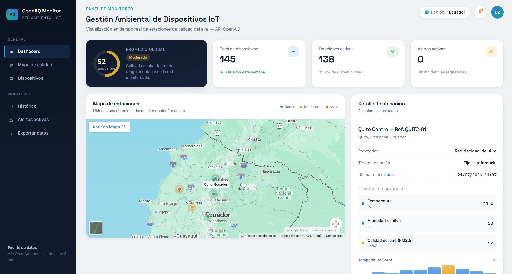

# OpenAQ Monitor

Interfaz web accesible para la gestión visual de dispositivos IoT relacionados con monitoreo ambiental y calidad del aire.

## Descripción del proyecto

Este proyecto presenta un panel de control estilo dashboard diseñado para visualizar información de estaciones ambientales, dispositivos IoT y métricas clave en tiempo real. La interfaz está estructurada con un diseño claro, jerarquía visual y componentes accesibles para facilitar la navegación y la comprensión de los datos.

## Objetivo

Proporcionar una vista funcional y visual de una plataforma de monitoreo ambiental basada en datos de OpenAQ, orientada a:

- supervisar estaciones de calidad del aire;
- revisar indicadores de estado y disponibilidad;
- visualizar ubicaciones geográficas de dispositivos;
- mostrar detalles de sensores y métricas asociadas.

## Características principales

- Diseño de interfaz moderno y organizado.
- Sidebar de navegación con secciones de General y Monitoreo.
- Panel principal con KPIs de desempeño.
- Mapa visual de estaciones con puntos por estado de calidad.
- Sección de detalle de ubicación con datos de sensores.
- Estilo responsive y enfoque en accesibilidad básica.

## Tecnologías utilizadas

- HTML5 para la estructura de la interfaz.
- CSS3 para el diseño visual, layout y componentes.
- Google Maps embed como referencia visual para la ubicación de estaciones.

## Estructura del proyecto

- [index.html](index.html): estructura principal de la interfaz.
- [styles.css](styles.css): estilos, paleta de colores, tipografías y diseño del dashboard.

## Cómo ejecutar el proyecto

No requiere instalación adicional. Solo debes abrir [index.html](index.html) en un navegador web moderno.

Opciones recomendadas:

1. Abrir directamente el archivo en el navegador.
2. Usar un servidor local simple como Live Server en Visual Studio Code.

## Instalación

No se necesitan dependencias externas para visualizar la interfaz. Basta con tener un navegador actualizado.

## Funcionalidades futuras

- integración con una API real de datos ambientales;
- filtros por región, fecha o tipo de estación;
- visualización de gráficos históricos;
- soporte para alertas automáticas y notificaciones.

## Capturas de referencia

La interfaz incluye un panel principal con KPIs, un mapa de estaciones y un bloque de detalle de ubicación para simular una experiencia de supervisión IoT.

## Nota

Este proyecto representa una propuesta visual y de interfaz de usuario, no una integración completa con servicios reales de monitoreo en tiempo real.
